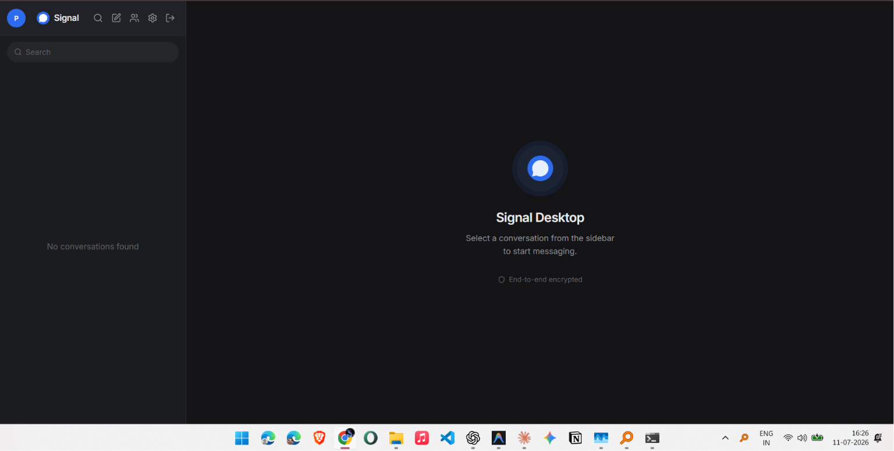
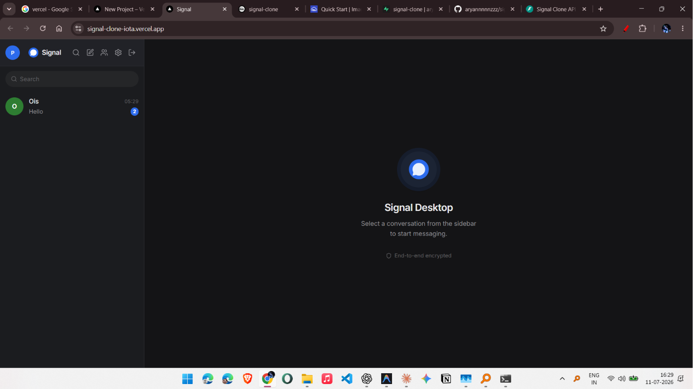
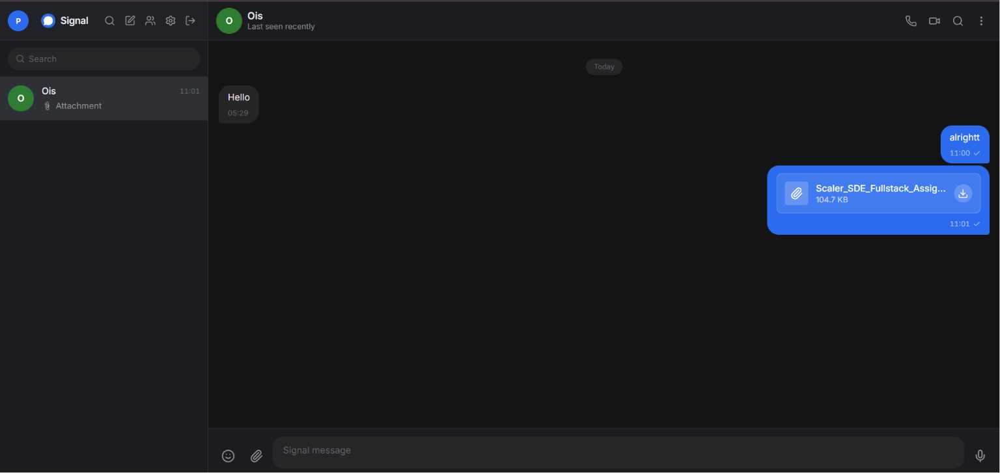
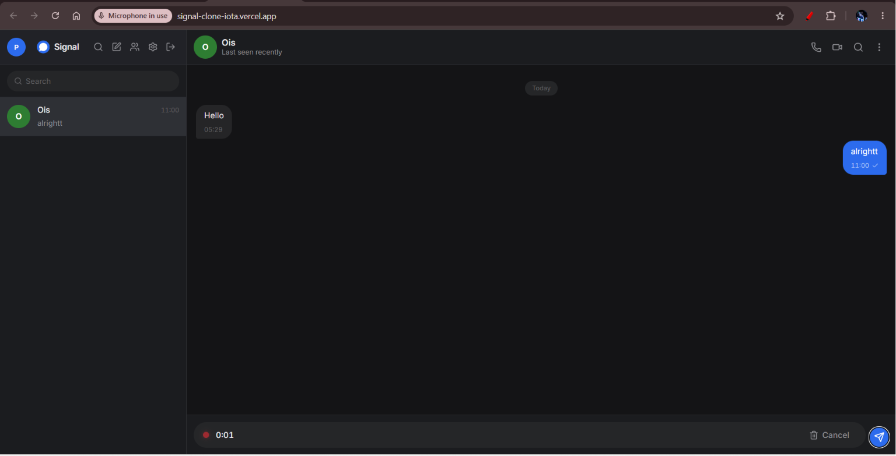
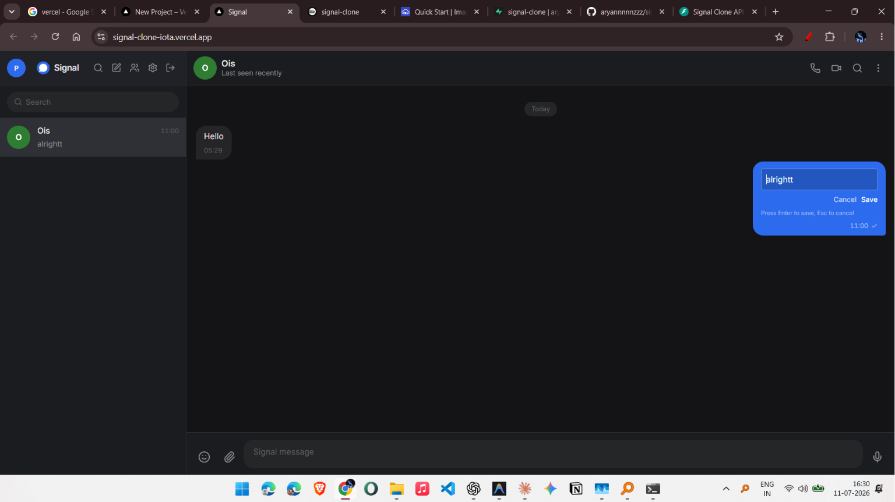
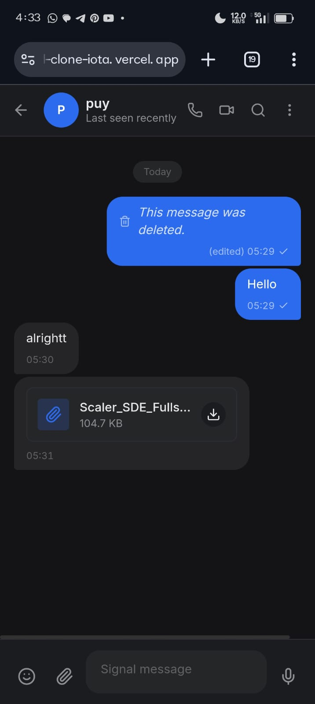

# Signal Clone | Full Stack Real Time Messaging Application

A full stack, Signal-inspired messaging platform built with Next.js, FastAPI, WebSockets, and JWT authentication. It delivers a modern real time chat experience with secure authentication, group conversations, voice messages, file sharing, emoji reactions, and a responsive interface, while showcasing production-style architecture and deployment on Vercel and Railway.

---

## Live Demo

**Frontend**: https://signal-clone-iota.vercel.app

**Backend API**: https://signal-clone-production.up.railway.app

**Swagger API Documentation**: https://signal-clone-production.up.railway.app/docs

---

## Features

### Messaging
- **Real-time messaging**: Instant message delivery using WebSockets.
- **Read & Delivery receipts**: Track when your messages are delivered and read.
- **Message Management**: Edit sent messages, delete messages, and reply to specific messages.
- **Typing indicators**: See when the other person is typing in real-time.
- **Global & Conversation search**: Easily find past messages or contacts.

### Groups
- **Group chats**: Create and participate in multi-user conversations.
- **Group management**: Add or remove members and update group settings.

### Media
- **Voice messages**: Record and send audio clips directly in the chat.
- **File & image attachments**: Share documents and media seamlessly.
- **Emoji support**: Full emoji picker and emoji reactions on messages.

### User Experience
- **Online/offline presence**: See who is currently online.
- **Optimistic UI updates**: Blazing fast UI interactions that don't wait for server response.
- **Infinite scrolling**: Efficiently load chat history as you scroll up.
- **Responsive UI**: Works beautifully across different screen sizes.
- **Dark/Light mode**: Native theme support for better accessibility.

### Settings
- **Customizable profiles**: Avatar upload and profile management.
- **Privacy & Notifications**: Browser notifications and adjustable appearance settings.

---

## 📸 Screenshots

### Home Dashboard
Shows the clean desktop interface after login with conversation list and modern Signal-inspired UI.



---

### Conversation & Messaging
Real-time messaging with delivery/read receipts, online presence, and responsive chat interface.



---

### File Sharing
Send documents and attachments directly inside conversations.



---

### Voice Messages
Record and send voice notes directly from the browser.



---

### Message Editing
Edit previously sent messages without deleting the conversation history.



---

### Mobile Responsive Design
Fully responsive interface optimized for mobile devices.



---

## Tech Stack

| Layer | Technology |
|---|---|
| **Frontend** | Next.js, React, TypeScript, Tailwind CSS |
| **Backend** | FastAPI, Python |
| **Database** | SQLite (currently), SQLAlchemy, Alembic |
| **Realtime** | WebSockets |
| **Deployment** | Vercel (Frontend), Railway (Backend) |

---

## Architecture

The application follows a decoupled client-server architecture:
- **REST APIs & WebSockets**: The Next.js frontend communicates with the FastAPI backend via standard RESTful endpoints for CRUD operations and establishes a persistent WebSocket connection for real-time events (messages, presence, typing indicators).
- **Optimistic Updates**: The frontend leverages optimistic UI updates to instantly reflect user actions (like sending a message or reacting) before the server confirms them, ensuring a fluid user experience.
- **Authentication**: Secure JWT (JSON Web Tokens) are used for authenticating both REST endpoints and WebSocket connections.
- **Database ORM**: The backend uses SQLAlchemy as the ORM to interact with the database efficiently and securely, managed by Alembic for schema migrations.

---

## Project Structure

```text
signal-clone/
├── backend/                  # FastAPI Application
│   ├── alembic/              # Database migrations
│   ├── app/                  # Application source code
│   │   ├── api/              # REST API routers
│   │   ├── models/           # SQLAlchemy database models
│   │   ├── schemas/          # Pydantic validation schemas
│   │   ├── services/         # Business logic
│   │   └── ws/               # WebSocket event handlers
│   ├── uploads/              # Local media storage
│   ├── alembic.ini           # Alembic configuration
│   └── requirements.txt      # Python dependencies
│
└── frontend/                 # Next.js Application
    ├── app/                  # Next.js App Router pages
    ├── components/           # Reusable React components
    ├── contexts/             # React Context (Auth, WebSocket)
    ├── hooks/                # Custom React hooks
    ├── lib/                  # Utility functions and API client
    ├── types/                # TypeScript interfaces
    └── package.json          # Node.js dependencies
```

---

## Local Setup

### 1. Clone the repository
```bash
git clone https://github.com/aryannnnnzzz/signal-clone.git
cd signal-clone
```

### 2. Backend Setup
Navigate to the backend directory and set up the Python environment:
```bash
cd backend
python -m venv venv

# Activate virtual environment
# On Windows:
venv\Scripts\activate
# On macOS/Linux:
source venv/bin/activate

# Install dependencies
pip install -r requirements.txt

# Run database migrations
alembic upgrade head

# Start the development server
uvicorn app.main:app --reload
```

### 3. Frontend Setup
Open a new terminal, navigate to the frontend directory, and start the Next.js app:
```bash
cd frontend

# Install dependencies
npm install

# Start the development server
npm run dev
```

---

## Deployment

- **Backend (Railway)**: The FastAPI backend is deployed on Railway. It uses a `Procfile` and standard Python environment setup. WebSocket connections are natively supported.
- **Frontend (Vercel)**: The Next.js frontend is deployed on Vercel for fast global edge delivery. Environment variables are configured to point to the Railway backend for both REST and WebSocket APIs.

---

## Notes

- Current deployment uses SQLite, so data may reset after Railway rebuilds or redeployments.
- Planned migration to Supabase PostgreSQL for persistent cloud storage.

---

## Future Improvements

- [ ] Supabase PostgreSQL migration
- [ ] Cloudinary storage for attachments
- [ ] End-to-end encryption (E2EE)
- [ ] Voice/Video calling
- [ ] Message pinning
- [ ] Message forwarding
- [ ] Better mobile support
- [ ] PWA support


---

## Author

**Aryan**  
GitHub: [aryannnnnzzz](https://github.com/aryannnnnzzz)

---

## License

This project is intended for educational and portfolio purposes.
